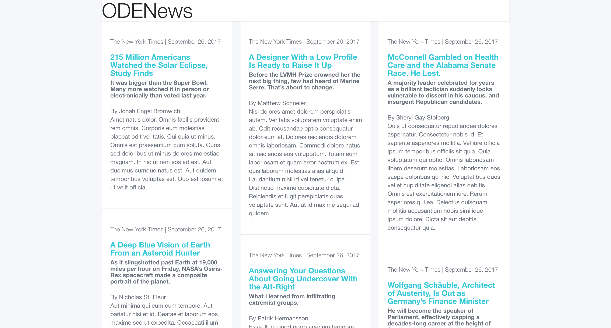

# Creating ODENews

## Given Challenge

1. Create an SQL database that stores news data. The columns of the database are up to you. As long as each row can represent a news article, that would be enough.
2. Add about five rows in the database with dummy data (just for testing).
3. Write ruby scripts that query to the database that you created, and present them on a webpage as a CSS-styled table.
4. Dump the SQL data and save it as an SQL file.
5. Upload your code and the SQL file to a Git repository.

## My Solution

### Database Schema

To store the news articles, I started from the premise that the articles would be original to this site, like a company blog. From this point of view, I decided each article would need a headline, byline, body, and publication date. I considered using the default `created_at` timestamp as the publication date, but I decided to decouple them to provide the flexibility to backdate articles. As I began to work on the seeds file, I discovered that The New York Times has a simple `times_wire` gem that I thought would be interesting to play with. In order to incorporate the Times, I changed the premise of the site from an internal blog to an aggregator of external news stories. To the database I added a subhead, url (to link to the full article), and publication (imagining that the site would pull from more than one source than the Times).

See the final schema [here](db/schema.rb).

### Seed Data

To seed the database, I used the `times_wire` gem to grab 20 articles from The New York Times. I would have prefered to use The Washington Post but their API doesn't have a ruby gem yet ;). I iterated through these Times articles and stored the relevant data from each in my database. I also wanted my site to include the first paragraph of each article as a teaser before you click through, but the Times API does not include that feature, so I used the `faker` gem to write a paragraph of lorem ipsem for each article. Obviously were this production data instead of test data I would find some other solution to include the real first paragrah of each article.

See the final seed file [here](db/seeds.rb).

### Querying the database

With just one table in my database, I was able to keep the [model](app/models/news_article.rb) simple. In a more fleshed-out version of this app, I could imagine making authors and publications their own tables so that a user could see all articles from a particular author or publication. But for the purposes of this exercise I stuck with one table and one model, and therefore didn't need any model associations. I added one simple method to the model to format the publication date into "Month Date, Year" for readability.

Similarly, because this is a one-page app, I just needed one [route](config/routes.rb) and one [controller](app/controllers/news_articles_controller.rb) with a simple `index` method to pass the news articles to the front-end view. I ended up adding a helper method to split the array of articles into roughly equal sub-arrays to easily create columns on the front-end.

### Styling the page

To style the page, I used the [Bulma](http://bulma.io/) CSS framework, which is based on Flexbox. This allows for responsiveness and flexibility. I wanted a clean and simple design. Here is what I ended up with:

### Dumping the database

The SQL data dump can be found [here](news_articles_database.sql).

### Enjoy!

I hope you like ODENews! Please let me know if you have any questions.
